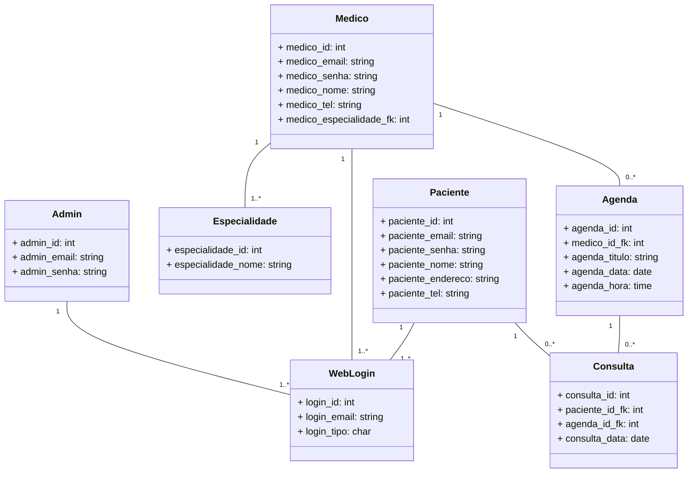

```mermaid

classDiagram
    class Admin {
        + admin_id: int
        + admin_email: string
        + admin_senha: string
    }

    class WebLogin {
        + login_id: int
        + login_email: string
        + login_tipo: char
    }

    class Medico {
        + medico_id: int
        + medico_email: string
        + medico_senha: string
        + medico_nome: string
        + medico_tel: string
        + medico_especialidade_fk: int
    }

    class Especialidade {
        + especialidade_id: int
        + especialidade_nome: string
    }

    class Paciente {
        + paciente_id: int
        + paciente_email: string
        + paciente_senha: string
        + paciente_nome: string
        + paciente_endereco: string
        + paciente_tel: string
    }

    class Agenda {
        + agenda_id: int
        + medico_id_fk: int
        + agenda_titulo: string
        + agenda_data: date
        + agenda_hora: time
    }

    class Consulta {
        + consulta_id: int
        + paciente_id_fk: int
        + agenda_id_fk: int
        + consulta_data: date
    }

    Admin "1" -- "1..*" WebLogin
    Medico "1" -- "1..*" WebLogin
    Paciente "1" -- "1..*" WebLogin
    Medico "1" -- "1..*" Especialidade
    Medico "1" -- "0..*" Agenda
    Paciente "1" -- "0..*" Consulta
    Agenda "1" -- "0..*" Consulta


```