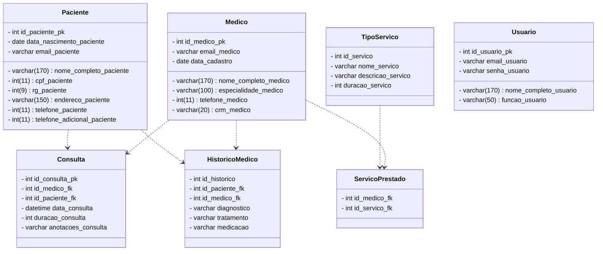

# Database Fast Bunny

Modelagem do banco de dados

```mermaid

classDiagram

Medico ..> Consulta
Medico ..> ServicoPrestado
Medico ..> HistoricoMedico
Paciente ..> HistoricoMedico
Paciente ..> Consulta
TipoServico ..> ServicoPrestado

class Medico{
    - int id_medico_pk
    - varchar(170) nome_completo_medico
    - varchar(100) especialidade_medico
    - varchar email_medico
    - int(11) telefone_medico
    - varchar(20) crm_medico
    - date data_cadastro
}

class Paciente{
    - int id_paciente_pk
    - varchar(170) nome_completo_paciente
    - date data_nascimento_paciente
    - int(11) cpf_paciente
    - int(9) rg_paciente
    - varchar email_paciente
    - varchar(150) endereco_paciente
    - int(11) telefone_paciente
    - int(11) telefone_adicional_paciente
}

class Usuario{
    - int id_usuario_pk
    - varchar(170) nome_completo_usuario
    - varchar email_usuario
    - varchar senha_usuario
    - varchar(50) funcao_usuario
}

class Consulta{
    - int id_consulta_pk
    - int id_medico_fk
    - int id_paciente_fk
    - datetime data_consulta
    - int duracao_consulta
    - varchar anotacoes_consulta
}

class TipoServico{
    - int id_servico
    - varchar nome_servico
    - varchar descricao_servico
    - int duracao_servico
}

class ServicoPrestado{
    - int id_medico_fk
    - int id_servico_fk
}

class HistoricoMedico{
    - int id_historico
    - int id_paciente_fk
    - int id_medico_fk
    - varchar diagnostico
    - varchar tratamento
    - varchar medicacao
}


```